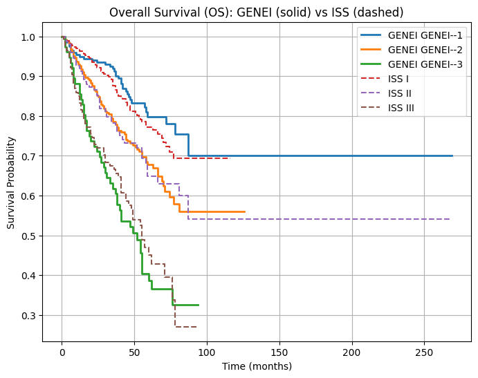
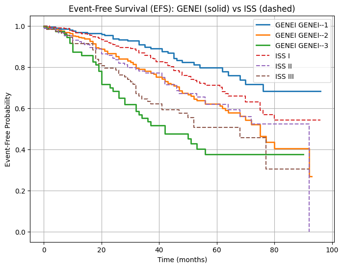

# GENEI: Patient Classification in GSE24080

This project aims to classify patients in the **GSE24080** dataset into three classes using the important genes **EPAS1**, **ERC2**, **PRC1**, **CSGALNACT1**, and **CCND1**, as discussed in the paper [**Gene expression profile of multiple myeloma and survival in the UAMS cohort (PMID: 34917133)**](https://pubmed.ncbi.nlm.nih.gov/34917133/). The methodology follows a similar approach to the **MRS classification** outlined in the paper [**MRS Classification of Multiple Myeloma**](https://www.sciencedirect.com/science/article/pii/S1936523321001492?via%3Dihub).

## Dataset Files

You can download the required files from the following locations:

1. **Clinical Data** (GSE24080 dataset with clinical information):

   * [GSE24080_MM_UAMS565_ClinInfo_27Jun2008_LS_clean.xls](https://geo.download/?acc=GSE24080&format=file&file=GSE24080%5FMM%5FUAMS565%5FClinInfo%5F27Jun2008%5FLS%5Fclean%2Exls%2Egz)

2. **Expression Data** (Series matrix):

   * [GSE24080_series_matrix.txt.gz](https://ftp.ncbi.nlm.nih.gov/geo/series/GSE24nnn/GSE24080/matrix/GSE24080_series_matrix.txt.gz)

3. **GPL570 Annotations** (Gene probe IDs):

   * [GPL570-55999.txt](https://www.ncbi.nlm.nih.gov/geo/query/acc.cgi?acc=GPL570) (Download full table)

---

## Execution Order and Steps

The following steps outline the process of extracting relevant data, preprocessing it, and performing classification.

### 1. **Unzip the Expression Data** (`gz_unzipper.py`)

* **Input**: `GSE24080_series_matrix.txt.gz`
* **Output**: `GSE24080_series_matrix.txt`

  This step decompresses the gzipped file containing the gene expression data into a text file for further processing.

### 2. **Extract Expression Matrix and Metadata** (`txt_to_csv.py`)

* **Input**: `GSE24080_series_matrix.txt`
* **Output**:

  * `expression_matrix.csv` (Gene expression data for all patients)
  * `sample_metadata.csv` (Metadata including patient information)

  This step breaks down the expression matrix into two CSV files: one for gene expression values and one for associated metadata like patient characteristics.

### 3. **Extract Five Genes' Expression Values** (`five_genes.ipynb`)

* **Input**:

  * `expression_matrix.csv` (Gene expression data)
  * `GPL570-55999.txt` (Gene annotations)
* **Output**: `five_gene_matrix.csv` (Expression values for the 5 key genes)

  In this step, we extract the expression values of the five genes **EPAS1**, **ERC2**, **PRC1**, **CSGALNACT1**, and **CCND1** for each patient in the dataset.

### 4. **Merge Data with Clinical Information** (`Merger.ipynb`)

* **Input**:

  * `five_gene_matrix.csv` (Gene expression data for the 5 genes)
  * `sample_metadata.csv` (Patient metadata)
  * `GSE24080_MM_UAMS565_ClinInfo_27Jun2008_LS_clean.xls` (Clinical data, including ISS Staging, OS, and PFS)
* **Output**: `final_columns.csv` (Merged dataset with gene values, clinical data, and survival information)

  This step merges the expression data of the five genes with additional clinical information, such as **ISS Staging**, **Overall Survival (OS)**, and **Progression-Free Survival (PFS)** events.

### 5. **Train a K-Nearest Neighbors (KNN) Classifier** (`FullTrain.ipynb`)

* **Input**: `final_columns.csv` (Merged dataset with clinical and gene expression data)
* **Output**: `full_GENEI.csv` (Predicted classification results for the patients)

  This step trains a KNN classifier on the merged dataset to classify patients based on the expression values of the five key genes.

### 6. **Compare ISS Staging and GENEI Classifications** (`comparion.ipynb`)

* **Input**: `full_GENEI.csv` (Results from the KNN classifier)
* **Output**: Displays comparison of ISS staging and GENEI classifications for **Overall Survival (OS)** and **Event-Free Survival (EFS)** in the notebook.

  In the final step, we compare the KNN-based GENEI classification with traditional **ISS Staging** in terms of patient survival outcomes (OS and EFS).

---

## Results and Insights

* The final classification output (`full_GENEI.csv`) will provide the predicted classes for each patient based on the expression values of the five important genes.
* The comparison of GENEI with **ISS Staging** will help determine whether GENEI can offer superior or complementary prognostic value in predicting patient outcomes like **OS** and **EFS**.

The Kaplan–Meier curves indicate that the GENEI classification system differentiates patient survival outcomes more distinctly than the ISS staging. Patients in the GENEI–1 group consistently show the highest overall and event-free survival, whereas GENEI–3 patients exhibit the poorest outcomes.
This suggests that GENEI captures gene expression–based prognostic signals that complement or surpass the clinical ISS categories.

---

## Notes

* Ensure you have all the required dependencies installed to run the Python scripts and Jupyter Notebooks (e.g., pandas, numpy, scikit-learn, etc.).
* The methodology is inspired by the approach used in the [MRS classification paper](https://www.sciencedirect.com/science/article/pii/S1936523321001492?via%3Dihub).

